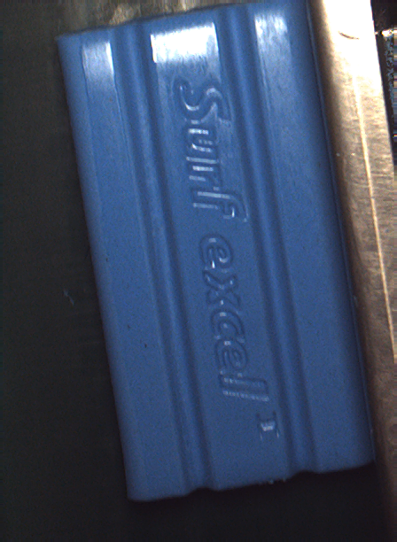

# Eye-patch shift Dataset

[eyeshift.ipynb](eyeshift.ipynb) contains code that identifies defects in eye-patches for shampoo packets.
First, a YOLOv8 model identifies horizontal and vertical cuts, then a linear regression is performed through the horizontal cuts,
and eye-patches outside a threshold are categorised as defective.

**Accuracy:** 92.98%

# Soap Dataset

[soap-binary-classifier.ipynb](soap-binary-classifier.ipynb) uses a simple fully-connected layer on the outputs from ResNet18, 
fine-tuned on a dataset of soap to classify as either defective or non-defective.

**Accuracy:** 100%

<table>
<tr>
<td>Non-Defective</td>
<td>Defective</td>
</tr>
  <tr>
    <td> </td>
    <td></td>
   </tr>
</table>

[soap-feature-clustering.ipynb](soap-feature-clustering.ipynb) is an unsupervised approach to defect detection in 
this dataset where features from the ResNet18 output undergo a Singular Value Decomposition (SVD) and are then clustered using Birch.

**Accuracy:** 99.55%

<table>
<tr>
<td>Ground Truth</td>
<td>SVD & Clustering</td>
<td>Prediction</td>
</tr>
  <tr>
    <td> </td>
    <td></td>
    <td></td>
   </tr>
</table>

[soap-autoencoder.ipynb](soap-autoencoder.ipynb) is actually a U-net which attempts to reconstruct masked images of soap to predict defective pieces by correcting errors.

**Accuracy:** untested.

<table>
<tr>
<td>Masked Input</td>
<td>Prediction</td>
</tr>
  <tr>
    <td> </td>
    <td></td>
   </tr>
</table>

[soap-fourier-analysis.ipynb](soap-fourier-analysis.ipynb) is a single-shot, unsupervised method for defect detection on a normalised dataset.
A non-defective single-shot reference image is chosen and the squared complex-difference between its Fourier Transform and all other images in the dataset are compared and clustered.

**Accuracy:** 100%

<table>
<tr>
<td>Fourier Transform of Soap</td>
<td>Histogram of Differences to Reference</td>
</tr>
  <tr>
    <td> </td>
    <td></td>
   </tr>
</table>

# Soap Side Dataset

# Shampoo Dataset
