This repository contains code developed at [AIVolved](https://aivolved.in/) for quality testing using Machine Learning & Artificial Intelligence. 
Several goals were pursued on key datasets including:

1. Eye-patch shift detection using non-ML computer vision techniques (92.98% accuracy)
2. Clustering & SVD on ResNet output for unsupervised defect detection in soap (99.55% acccuracy)
3. Unsupervised, single-shot defect detection in soap using the Fourier Transform (100% accuracy)
4. Cut detection in shampoo using Sobel & Canny filters + Hough Transform (N/A)

# Eye-patch shift Dataset

[eyeshift.ipynb](eyeshift.ipynb) contains code that identifies defects in eye-patches for shampoo packets.
First, a YOLOv8 model identifies horizontal and vertical cuts, then a linear regression is performed through the horizontal cuts,
and eye-patches outside a threshold are categorised as defective.

**Accuracy:** 92.98%

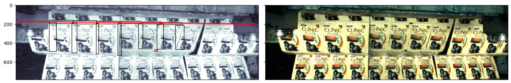
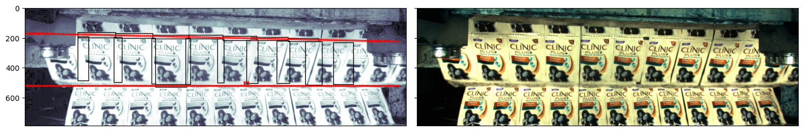

# Soap Dataset

[soap-binary-classifier.ipynb](soap-binary-classifier.ipynb) uses a simple fully-connected layer on the outputs from ResNet18, 
fine-tuned on a dataset of soap to classify as either defective or non-defective.

**Accuracy:** 100%

<table>
<tr>
<td>Non-Defective</td>
<td>Defective</td>
</tr>
  <tr>
    <td> 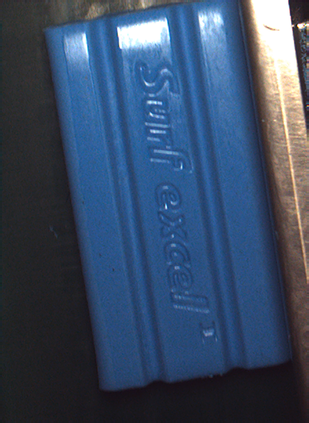</td>
    <td>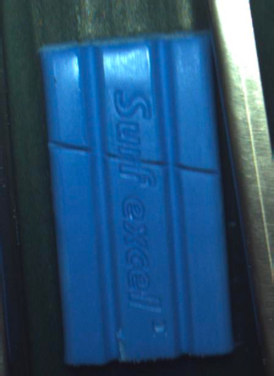</td>
   </tr>
</table>

[soap-feature-clustering.ipynb](soap-feature-clustering.ipynb) is an unsupervised approach to defect detection in 
this dataset where features from the ResNet18 output undergo a Singular Value Decomposition (SVD) and are then clustered using Birch.

**Accuracy:** 99.55%

<table>
<tr>
<td>Ground Truth</td>
<td>SVD & Clustering</td>
<td>Prediction</td>
</tr>
  <tr>
    <td> 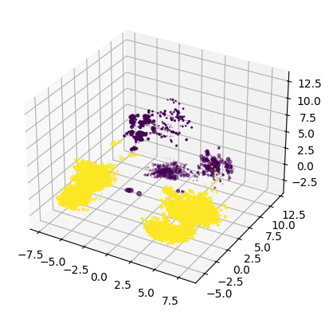</td>
    <td>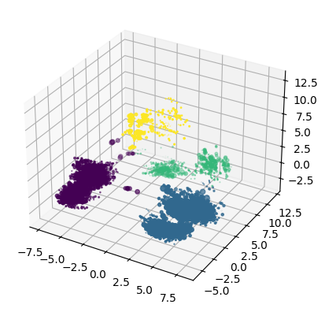</td>
    <td>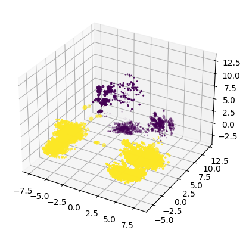</td>
   </tr>
</table>

[soap-autoencoder.ipynb](soap-autoencoder.ipynb) is actually a U-net which attempts to reconstruct masked images of soap to predict defective pieces by correcting errors.

**Accuracy:** untested.

<table>
<tr>
<td>Masked Input</td>
<td>Prediction</td>
</tr>
  <tr>
    <td> 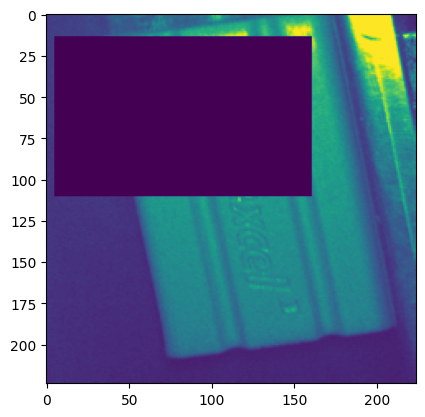</td>
    <td>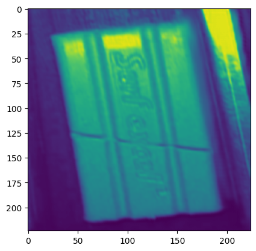</td>
   </tr>
</table>

[soap-fourier-analysis.ipynb](soap-fourier-analysis.ipynb) is a single-shot, unsupervised method for defect detection on a normalised dataset.
A non-defective single-shot reference image is chosen and the squared complex-difference between its Fourier Transform and all other images in the dataset are compared and clustered.

**Accuracy:** 100%

<table>
<tr>
<td>Fourier Transform of Soap</td>
<td>Histogram of Differences to Reference</td>
</tr>
  <tr>
    <td> 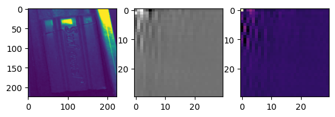</td>
    <td>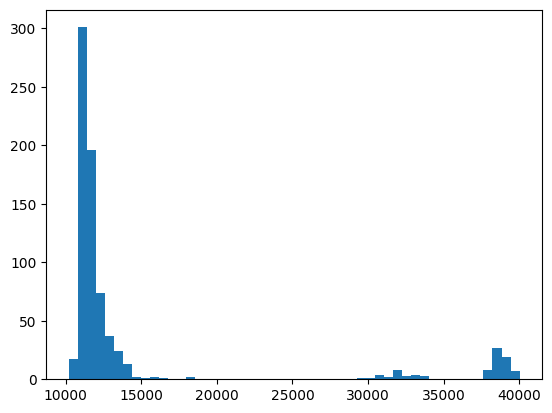</td>
   </tr>
</table>

# Shampoo Dataset

[shampoo.ipynb](shampoo.ipynb) contains code that identifies defective cuts in shampoo packets. 
First, vertical cuts are extracted using a YOLOv8 model, the cuts are equalised and normalised and a sobel filter is applied to enhance edges.
A Canny edge-detector is used followed by a Hough transform to identify cuts.

**Accuracy:** visually excellent. No quantitative measure.

<table>
<tr>
<td>Masked Input</td>
<td>Cuts Extracted from YOLOv8</td>
</tr>
  <tr>
    <td> 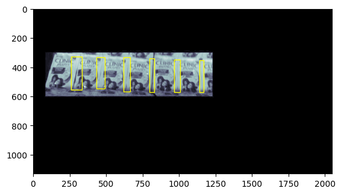</td>
    <td>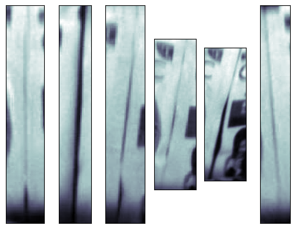</td>
   </tr>

<tr>
<td>Equalised & Sobel Filtered</td>
<td>Canny Edge-detection & Hough Transform</td>
</tr>
  <tr>
    <td> 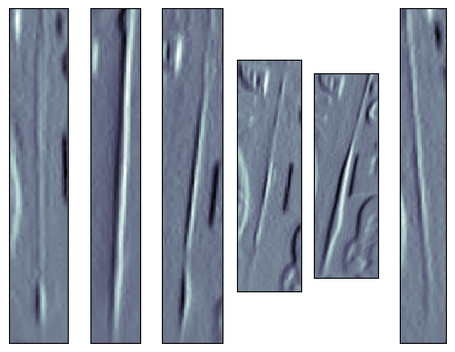</td>
    <td>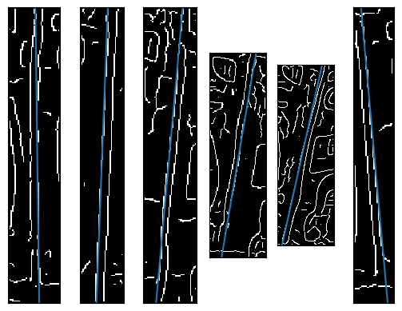</td>
   </tr>
</table>

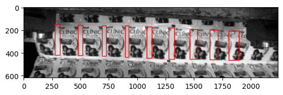
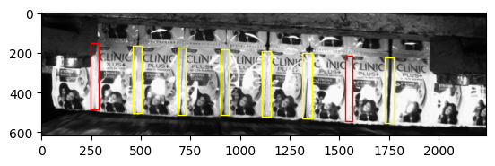
